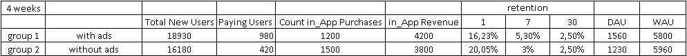

## Анализ результатов А/Б-тестирования.

выполнил: *Григорий Михолап*  
дата: *20/01/2016*

```{r setoptions, echo=FALSE, warning=FALSE, message=FALSE}
# глобальные настройки для chunks
library(knitr)
opts_chunk$set(echo=FALSE, warning=FALSE, message=FALSE)
```

```{r  echo=FALSE, results='hide', warning=FALSE, message=FALSE}
# Подключаем нужные библиотеки
library("dplyr")
library("ggplot2")
library("lattice") 
library("xtable")
library("car")
library(lubridate)
library(reshape2)
library(exactci)
```

**Задание:**
Было принято решение провести А/Б тестирование в игре, одной группе пользователей показывали рекламу как обычно, другой не показывали вообще, и после этого были получены результаты, представленные в таблице ниже. 


*Пояснения:*  
Paying users – количество пользователей, совершивших хотя бы одну покупку в игре  
Count in_App – количество покупок в игре  
In_App Revenue – прибыль только с покупок в игре (без прибыли с рекламы)  
Retention 1,7,30 – ретеншн соответственно 1-го, 7-го и 30-го дня.  

Эксперимент длился 4 недели. Сделайте выводы и дайте рекомендации.


**Выводы кратко:** в рамках данного анализа мы рассчитали основные показатели воронки продаж для обоих вариантов и проверили статистическую значимость различий. По средней конверсии в первую продажу лучше отработал вариант с рекламой, но по среднему числу продаж на одного игрока лучше был вариант без рекламы. Подтвердить значимость различий по основному показателю, средней выручке с пользователя, на имеющихся данных не удалось. 


**Замечание** по поводу программного кода:
Программный код, который используется в отчете можно найти [по ссылке](https://github.com/Grag2015/testInfotech/blob/master/Task%203%20AB-test.Rmd) 

## 1. Анализ показателя "Paying Users"

group  | Total New Users  | Paying Users  | Rate1 = Paying/Total
------------- | ------------- | ------------- | -------------
A:with ads | `18930` | `980` | `r round(980/18930,4)*100`%
B:without ads  | `16180`  | `420`  | `r round(420/16180,4)*100`%

Я добавил дополнительный столбец `Rate1`, в котором рассчитал долю игроков, которые произвели платеж (т.н. конверсию в платеж). Мы видим, что в группе с рекламой (далее группа "А") конверсия в платящих игроков выше (см. столбец Rate1), чем в группе без рекламы (далее группа "В"). 

Проверим является ли это различие статистически значимым, либо оно просто вызвано случайными колебаниями.
Для начала мы предполагаем, что события "Пользователь оплатил" и "Пользователь не оплатил" подчиняются Биноминальному распределению. Для группы "A" мы имеем биноминальное распределение с параметром "вероятность успеха" равным `r round(980/18930,4)`, а для группы "B" - `r round(420/16180,4)`  

Теперь нам необходимо проверить, какая из гипотез верна:  
* Нулевая гипотеза Н0 - конверсии равны.  
* Альтернативная гипотеза - конверсии не равны.  
Рассчитаем вероятность получить указанные в таблице результаты, при условии, что верна нулевая гипотеза.

```{r echo=T}
test <- binom.test(x=420, n=16180, p = 0.0518, conf.level = 0.99)
test$p.value
```
Мы видим, что эта вероятность практически равна нулю, что дает нам основание отвергнуть нулевую гипотезу о равенстве конверсий и заявить, что конверсии значимо различаются.

Рассчитаем 99%-доверительные интервалы для оценок наших конверсий.  
A:with ads
```{r echo=T}
binom.test(980, 18930, conf.level = 0.99)$conf.int
```

B:without ads
```{r echo=T}
binom.test(420, 16180, conf.level = 0.99)$conf.int
```
Мы видим, что доверительные интервалы не пересекаются, что еще раз подтверждает правильность результатов теста. И мы можем сказать, что в среднем вариант "A" конвертирует  в `2 (=5.18/2.6)` раза лучше, чем вариант "B", при этом доверительный интервал для данной оценки составляет `(1.6-2.5)`.

**Замечание** по поводу объема выборки - для получения статистически значимых результатов для оценки уровня конверсии достаточно выборки гораздо меньшего размера - в 5-10 раз меньше. Учитывая, что стоимость привлечения игрока (точнее скачивания мобильного приложения) на развитых рынках составляет порядка 3-4$ (см. [статью](http://gopractice.ru/mobile_apps_market_2014/)), то такое сокращение выборки сэкономит значительные финансовые ресурсы.

## 2. Анализ показателя "Count in App Purchases"
group  | Total New Users  | Paying Users  | Count in App Purchases  | Rate2 = Purchases/Paying  | lambda
------------- | ------------- | ------------- | ------------- | ------------- | -------------
A:with ads | `18930` | `980` | `1200` | `r round(1200/980,2)` | `r round(1200/18930,4)`
B:without ads  | `16180`  | `420`  | `1500`  | `r round(1500/420,2)` | `r round(1500/16180,4)`

**Замечание**: для анализа этого показателя лучше всего иметь полные данные наблюдений (а не только агрегированные показатели), чтобы понимать характер распределения, которому подчиняются эти данные.

В настоящих же услових, мы можем предположить, что количество покупок подчиняется закону распределения Пуассона с параметром lambda, рассчитанным в таблице выше по формуле `Count in_App Purchases/Total New Users`. 

**Замечанние 2**: Распределение Пуассона является дискретным и принимает любые целые неотрицательные значения `n= 0, 1, 2, 3,...`  с заданными вероятностями `p(n)=lambda^n*exp^(-lambda)/n!`. Для проверки насколько наше предположение о распределении Пуассона соответствует действительно мы можем рассчитать веротность p(0) и сравнить с долей пользователей, которые сделали 0 покупок. (данных для других проверок у нас нет)
```{r}
lambda1 <- round(1200/18930,4)
lambda2 <- round(1500/16180,4)
```
теоретические вероятности:
```{r echo=T, results='hold'}
lambda1^0*exp(-lambda1) # with ads
lambda2^0*exp(-lambda2) # without ads
```
доли пользователей, которые сделали 0 покупок:
```{r echo=T, results='hold'}
round((18930-980)/18930,4) # with ads
round((16180-420)/16180,4) # without ads
```
Как видим для первого случая эти числа практически равны, для второго тоже достаточно близки.
Это подтверждает правильность нашего выбора распределения.

Рассчитанные для обоих случаев параметры `lambda` кроме того указывают среднее число покупок, совершенных одним пользователем. Для удобства можем говорить о среднем числе покупок, совершенных 100 пользователями, и мы видим, что в случае "A" 100 пользователей сделают 6 покупок, а в случае "B" 100 пользователей сделаю 9 покупок, т.е. в полтора раза больше.

Далее, проверим, как в первом разделе отчета, является ли это различие статистически значимым либо оно просто вызвано случайными колебаниями.
```{r echo=T}
test <- poisson.test(x = c(1500,1200), T = c(16180,18930))
test$p.value
```
Как видим различия статистически значимы (т.к. `p-value<<0.05`) и можно говорить, что в случае "B" пользователи делают покупок в среднем в 1.45 раза (доверительный интервал для этого коэффициента (`r round(test$conf.int,2)`))

Рассчитаем доверительные интервалы для оценок среднего числа покупок.  
A:with ads
```{r}
poisson.test(x = c(1200), T = c(18930))$conf.int
```

B:without ads
```{r}
poisson.test(x = c(1500), T = c(16180))$conf.int
```
Как видим доверительные интервалы не пересекаются, что также подтверждает вывод о статистической значимости различий.

## 3. Анализ показателя "in App Revenue"

group  | Total New Users  | Count in App Purchases  | in App Revenue per user  | Rate1 = Revenue/Purchases  | Rate2 = Revenue/Users
------------- | ------------- | ------------- | ------------- | ------------- | -------------
A:with ads | `18930` | `1200` | `4200` | `r round(4200/1200,2)` | `r round(4200/18930,2)`
B:without ads  | `16180`  | `1500`  | `3800` | `r round(3800/1500,2)` | `r round(3800/16180,2)`

**Замечание**: `in App Revenue` - один из важнейших показателей и для анализа этого показателя необходимо иметь полные данные наблюдений, т.е. данные о платежах каждого пользователя, а не только агрегированные показатели. Подобные показатели как правило имеют распределения похожие на нормальное распределение, которое задается 2-мя параметрами - матожиданием и дисперсией. На основании имеющихся данных мы не сможем оценить дисперсию этой случайной величины, что критически важно для сравнения средних. Поэтому сделаем анализ без проверки статистической значимости.

Итак, средний чек (см. Rate1) в случае "B" был ниже, чем в случае "A" - 2.5 vs 3.5, но выше мы обнаружили, что в среднем пользователи "B" совершали больше покупок и как результат (см. Rate2) - в среднем на одного пользователя "B" выручка была выше - 0,23 у.е. против 0,22 у.е. с пользователя "A". Но, как сказано выше, проверить значимость этих различий мы не можем.

## 4. Анализ показателя "retention"

group  | retention 1  | retention 7  | retention 30
------------- | ------------- | ------------- | -------------
A:with ads | `16.23%` | `5.30%` | `2.5%`
B:without ads  | `20.05%`  | `3%`  | `2.5`

Судя по динамике показателя `retention` пользователи в группе "А" достаточно быстро привыкают к рекламе и отток падает. В конечном итоге через 30 дней нет различий по этому показателю. Кроме того, на 7-й день отток в приложении с рекламой даже ниже чем без рекламы.

Интересно рассчитать такой показатель как общее количество игровых дней по всем игрокам. (человеко-дней в игре). Для сравнения этого показателя можно рассчитать площадь под каждым из графиков ниже (это кусочно-заданные функции, в которых имеющиеся точки были соединены отрезками прямой)
```{r}
days <- seq(1,30)
var1 <- numeric(length = 30)
is.na(var1) <- T
var1[1] <- 16.23
var1[7] <- 5.30
var1[30] <- 2.50
var2 <- numeric(length = 30)
is.na(var2) <- T
var2[1] <- 20.05
var2[7] <- 3.00
var2[30] <- 2.50
df1 <- data.frame(days,var1)[!is.na(var1),]
df2 <- data.frame(days,var2)[!is.na(var2),]
df3 <- cbind(df1,var2=df2$var2)
```

```{r}
ggplot(data = data.frame(days,var1,var2),aes(x=days, y=var1)) + geom_point(na.rm = T, col="blue")+geom_path(size = 1, data = df3, col="blue")+geom_point(na.rm = T, aes(x=days, y=var2), col="red")+geom_path(size = 1, data = df3, col="red", aes(x=days, y=var2))+xlab("Дни")+ylab("retention")
```

Рассчитаем как различаются площади под графиком
```{r echo=T}
s1 <- (16.23+5.3)*(7-1)/2+(5.3+2.5)*(30-7)/2 # вариант с рекламой
s2 <- (20.05+3)*(7-1)/2+(3+2.5)*(30-7)/2 # вариант без рекламы
round((s1/s2-1)*100)
```
Как видим, в приложении с рекламой в течение месяца было проведено на 17% больше игровых дней. что на мой взгляд достаточно неожиданный результат.

**Результаты:** 

**1**. Первый показатель в воронке продаж это конверсия в платящих игроков `Paying Users/Total New Users`
По данному показателю значительно лидирует варианта с рекламой - конверсия в этом варианте составила `5.18%` против `2.6%` для варианта без рекламы. Доверительные интервалы для обеих оценок `(4.8%-5.6%)` и `(2.3%-2.9%)` соответственно. **Т.о. наличие рекламы срабатывало как побуждающий к покупке триггер.**

**2**. Следующий показатель в воронке продаж - `Count in_App Purchases/Total New Users`. По этому показателю лучше сработал вариант без рекламы. Наш анализ показал, что без рекламы пользователи совершали в `1.45` раз больше покупок, т.е. были больше вовлечены в игру. Как объяснить такое поведение? Есть два соображения:  
а) пользователи играя без рекламы не имели дополнительного отвлекающего баннера и больше вовлекались в игру. Хотя анализ показателя `retention` говорит не в пользу данного предположения  
б) "качество аудитории ниже" - как мы видели реклама в приложении лучше мотивировала к первой покупке, т.е. цепляла аудиторию, но ненадолго, в отличие от приложения без рекламы, которое цепляло реже, но сильнее.

**3**. Один из основных показателей в воронке продаж - это доход на одного пользователя `in_App Revenue per User`, но нельзя сказать достоверно, какой вариант A или B лучше, т.к. недостаточно данных для статистической проверки различий.

**4**. Надо также упомянуть, про такой неучтенный в анализе показатель, как доход с рекламы, возможно пользователи с рекламой сделали немало переходов по рекламных баннерам (и принесли доход, если схема оплаты cpc), но при этом чаще отвлекались от игры чем и вызвано падение среднего числа покупок.

    
 ___________   

```{r echo=FALSE, results='hide', warning=FALSE, message=FALSE}
# knit2html('Task 3 Advert channels.Rmd', encoding="UTF-8")
# browseURL('Task 3 Advert channels.Rmd')

```

